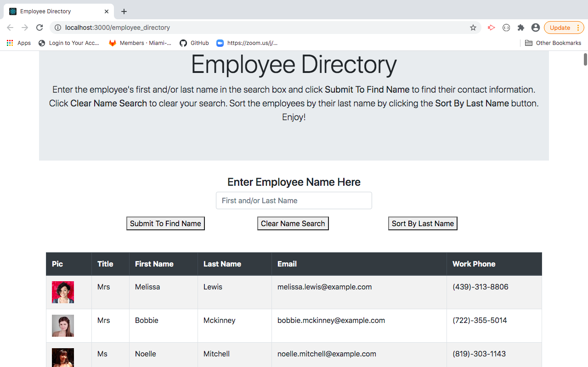
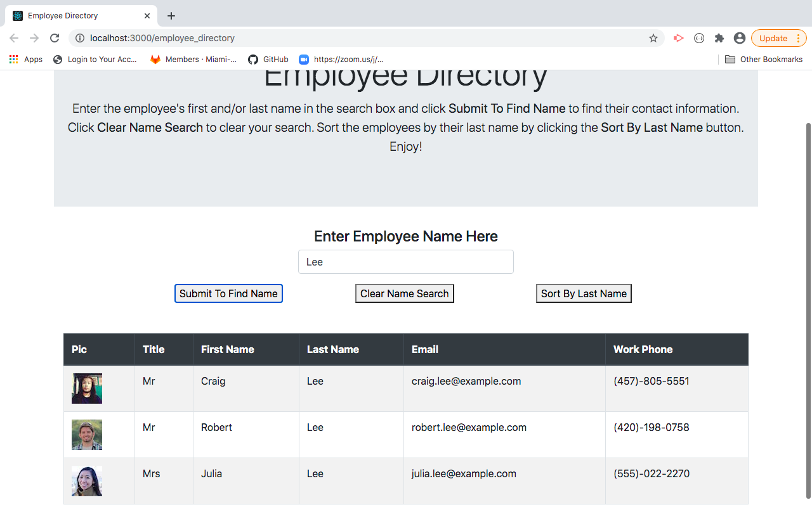
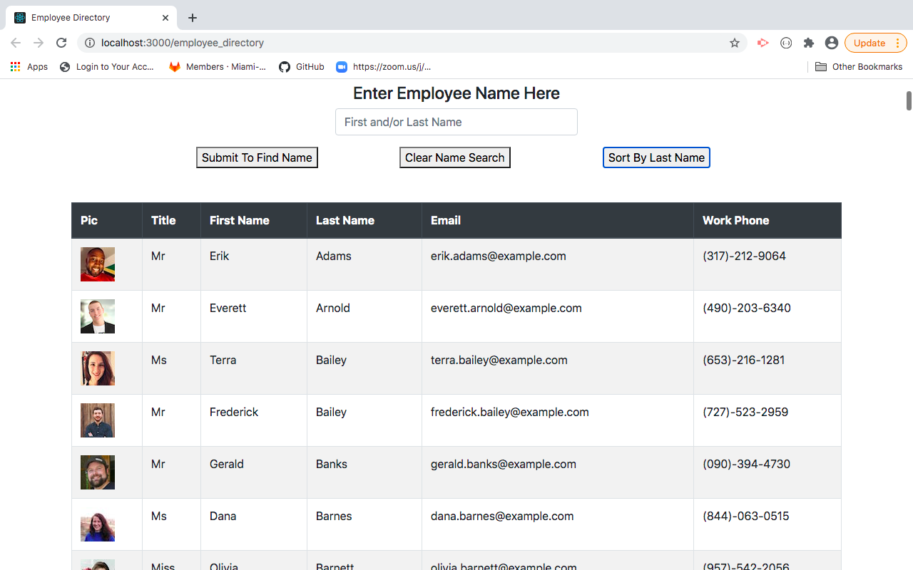

# Employee Directory

This is a simple employee directory application so the user can find their employee's contact information.  The user can find their employees by entering their first and/or last name into the search box and then clicking the "Submit To Find Name" button.  This will reduce the list of employees making it easier for the user to find their chosen employee.  The user can then click the "Clear Name Search" button to clear their search if they need to find another employee.  The "Sort By Last Name" button allows the user to alphabetize their employees by their last name.  This application was created using React and styled using Bootstrap.

## Image of Home Page

## Image of Name Search

## Image of Employees Sorted by Last Name
